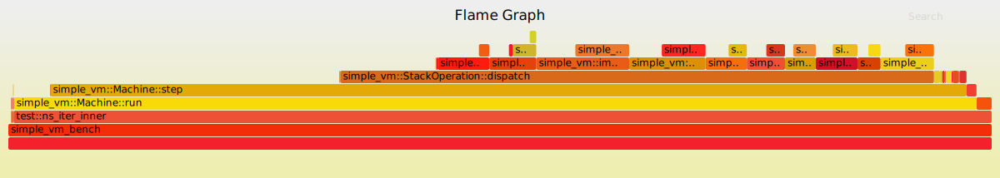

# simple vm rust

[](https://travis-ci.org/stanistan/simple-vm-rust)

This is an implementation of a super simple stack based VM in Rust, as a learning
exercise for myself. Absolutely do not use this for anything real or production worthy.

The language and APIs will change over time.

A lot of this is based on https://csl.name/post/vm, but while that is written in Python,
this is in not :)

I'm using the simplicity of the language to play around with my understanding of Rust,
for code organization, performance optimizations, and other idioms. If you check out the
[benchmarking](#benchmarking) section, you can see that I've spent a bunch of time on
trying to optimize the Fibonnaci program in the `examples/` directory, and have made a
ton of prorgress. As of `d474ca45365c2f6dc3d15c3357f64fa439db5be`, `fib_10` runs in about
33% of the original runtime.

## The Language

Right now this is a super simple stack based language that supports:

- Basic values: `Num`, `Bool`, and `String`
- Labels (for `jmp`, `call`, and `return`)
- Operations: `swap`, `rot`, `over`, `drop`, `dup`
- Comparison and boolean operations
- Arithmetic operations
- string to int and int to string parsing (no error handling for this)

## Running

Assuming you have [`rustup`](https://www.rustup.rs).

#### Testing

```sh
cargo test
```

#### Examples

Run the fib program for the 5th fibonacci number (debug).

```sh
cargo run -- examples/fib 5
```

Run this in release mode.

```sh
cargo run --release -- examples/fib 5
```

## Benchmarking & Profiling

Use [`cargo benchcmp`](https://github.com/BurntSushi/cargo-benchcmp) for bench comparisons.

#### Commits and perf numbers over time

All of these are run on an Early 2015 13-inch Macbook Pro, 2.9 GHz Intel Core i5, 16GB RAM.

| Commit                                     | `fib_10` ns/iter |
| :----------------------------------------- | ---------------: |
| `bbd24ad4494710598c8a20e28635763c184ce72c` |        `180,305` |
| `a7436cd672065204e540ec5233126740f20b30a6` |        `130,614` |
| `9eddfd3f54e838faf4eea49ed62bbc3fcb3c49bb` |        `129,146` |
| `25f7cda330a34de18dc1a8fff68bc94c3f9b8bf5` |        `100,917` |
| `933f94dcde1ce3bf3aa7aee72e15ccfa92d15b87` |         `84,027` |
| `e4c00cb51ea5060e8d05f63a41237fa1cae0e28`  |         `77,163` |
| `d474ca45365c2f6dc3d15c3357f64fa439db5be`  |         `58,518` |

```sh
git stash && cargo bench > bench-current && git stash pop && cargo bench > bench-new
cargo benchcmp bench-current bench-new
```

#### Getting Flamegraphs

The idea here is to run a profiler inside a docker container to actually get some flamegraphs
out, since running them on MacOS is [pretty unweildy](http://carol-nichols.com/2015/12/09/rust-profiling-on-osx-cpu-time/),
and just straight up might not work at all, but it is [usable elsewhere](https://blog.anp.lol/rust/2016/07/24/profiling-rust-perf-flamegraph/).

We are also using [BrendanGregg/FlameGraph](https://github.com/brendangregg/FlameGraph), so that should be somewhere
in your `$PATH`.

```sh
prof/run.sh fib fib_10
cat perf.script | stackcollapse-perf.pl | flamegraph.pl > bench.svg
```


